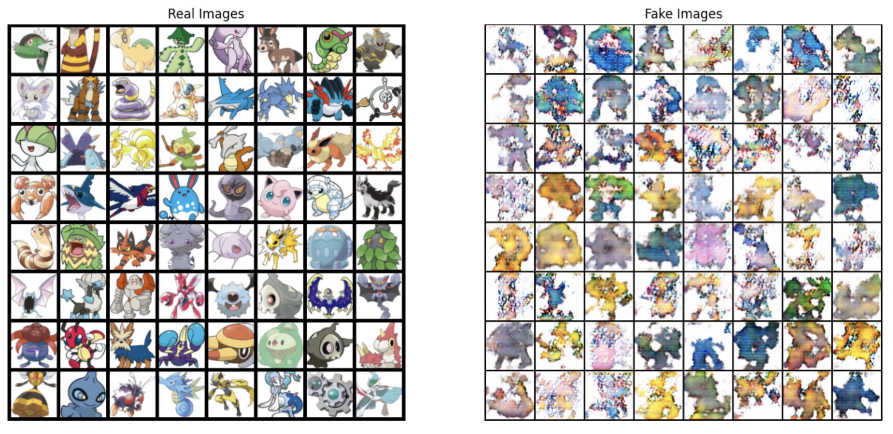

# Pokemon Generator using DCGAN

This project utilizes PyTorch and Deep Convolutional Generative Adversarial Network (DCGAN) to generate new Pokemon characters. The model is trained on a dataset of existing Pokemon images to create unique and realistic designs. The generated images showcase the model's ability to produce diverse and imaginative Pokemon characters in the style of the franchise.

## Dataset
The dataset used for training the DCGAN model consists of images of existing Pokemon characters from kaggle.

## Model Architecture
The DCGAN architecture consists of a generator and a discriminator network. The generator takes random noise as input and generates new images, while the discriminator tries to distinguish between real and generated images. Through adversarial training, the generator learns to produce more realistic images over time.

## Training
The model was trained on a GPU for 100 epochs to optimize the generator and discriminator networks. The training process involved adjusting hyperparameters such as learning rate, batch size, and number of epochs to achieve optimal results.

## Results
After training, the model was able to generate new Pokemon characters that exhibit a wide range of features and characteristics. The generated images showcase the diversity and creativity of the model in producing novel designs inspired by existing Pokemon.

    

## Conclusion
This project demonstrates the capabilities of DCGAN in generating new Pokemon characters based on a dataset of existing images. The generated Pokemon showcase the model's ability to create diverse and imaginative designs, providing a fun and creative way to explore new possibilities within the Pokemon universe.
